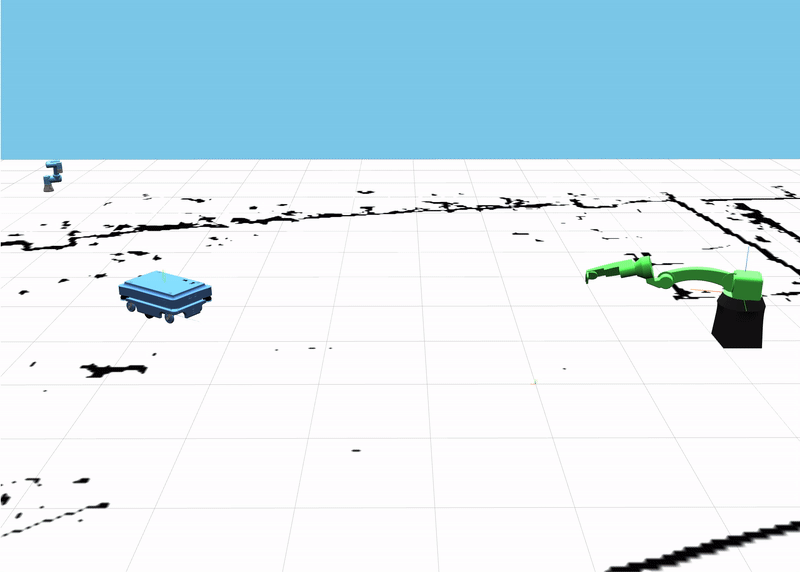

### Requirements
Python 3 and Pipenv 



## Instructions

1. Create a new folder, do `pip3 install pipenv` -> `pipenv shell` -> `pip3 install flask` then clone this repo

2. `flask run` and navigate to `127.0.0.1:5000` on your favorite browser

### Routes 

* `/`:  Home page, showcases the FANUC + draggable box IK solver
* `/1`: Testing page, testing different Onshape models and their mates
* `/activity`: Activity page, where you can mess with the given environment and make your own animation! 
* `example`: Holds a simple activity example of an animation loop

### How to add your own static files

1. Navigate to `/your/path/to/testingjavascript/app/static/js/activity.js` in a shell or text editor to mess with the current environment

2. Open a browser window (disable your cache if you haven't already), and go to `127.0.0.1:5000/activity`

3. Make a quick object in Onshape, right click on the part, hit Export, set the filetype to GLTF and resolution to Coarse, and save it to `testingjavascript/app/static/gltf/` 

4. If you don't want to make an object, take a look at `app/static/gltf/` folder and use the three.js GLTF Loader to load something into your scene

### How to use GLTFLoader 

```
// Create a new loader object
const loader = new GLTFLoader();

// call the load function within loader
// it takes in the file location within the server and 3 functions as parameters
// the only param that matters is the first one
// the other two print out loading percent to the console window or an error if one occurs
loader.load(
  // resource URL, change YOUR_FILE_HERE 
  './static/gltf/YOUR_FILE_HERE.gltf',
  /*
   gltf is the loaded gltf file, here you can restructure the assembly hierarchy or just immediately add an object to the scene
  */
  function ( gltf ) {
    console.log(gltf.scene);
    scene.add(gltf.scene);
  },
  // called while loading is progressing
  function ( xhr ) {

    console.log( ( xhr.loaded / xhr.total * 100 ) + '% loaded' );

  },
  // called when loading has errors
  function ( error ) {

    console.log( error );

  }
);
```

### Animation Help and Syntax

In order to animate something within a scene, you have to modify an object's rotation or position during the animation loop. Here's a sample animation and rendering function that you'll use:

```
// animate function
function animate(){

	// requests an animation frame at around 60Hz 
    requestAnimationFrame(animate);

    // update any controls object you have to have the ability to rotate the camera
    controls.update();

    // Here I'm updating an object's rotation attribute to change by .3 rads per frame
    object.rotateY(.3)

    // The object is also going to move along the x axis by 2 units per frame
    object.translateX(2)

    // rotateX, rotateY, rotateZ, translateX, translateY, translateZ are all available to use
    // on an Object3D class

    // translateOnAxis( your_specified_axis, distance ) exists as well 

    // If you want to query the object's current position, use this
    curr_pos = new Vector3(0,0,0);

    // update the curr_pos Vector with the object's current world position
    object.getWorldPosition(curr_pos);

 	// call render
    render();
 
};

// immediately call animate
animate();

// render function
// update the scene and camera to the browser window
function render() {
  renderer.render( scene, camera );
}
```

### Need Help? 

* Navigate to `127.0.0.1:5000/example` to view the example animation. To look at the file locate `testingjavascript/app/static/js/example.js` and try to modify the code to do something new! 